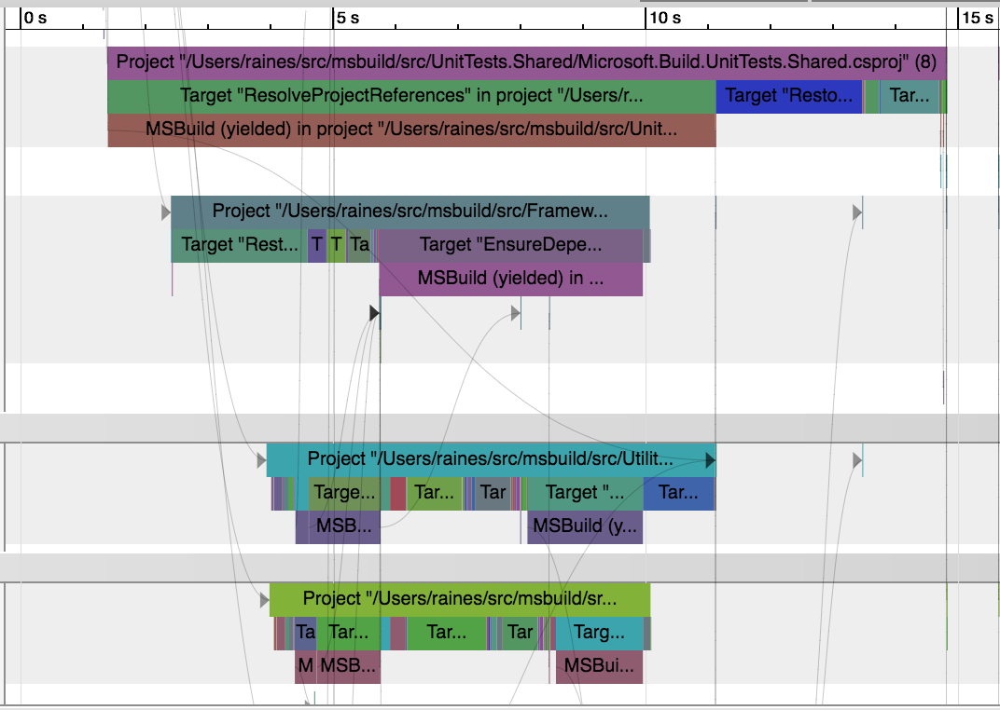

# TraceEventLogger
An MSBuild logger that emits trace_event JSON suitable for Chrome’s [Trace-Viewer](https://github.com/catapult-project/catapult/blob/master/tracing/README.md).



## Usage

Because this logger doesn't preserve all of the information needed to debug builds in general, it's a good idea to capture a [binary log](https://github.com/Microsoft/msbuild/wiki/Binary-Log) and replay it through this logger.

Build your project with an attached binary log

```
msbuild project.csproj /bl
```

After you have a binary log, replay it with the TraceEventLogger attached

```
msbuild /l:path\to\TraceEventLogger.dll msbuild.binlog
```

This will emit a file named `msbuild_events.json` in the current working directory.

Using Chrome, open <a href="chrome://tracing">chrome://tracing</a>, click "Load", and browse to the log output.
